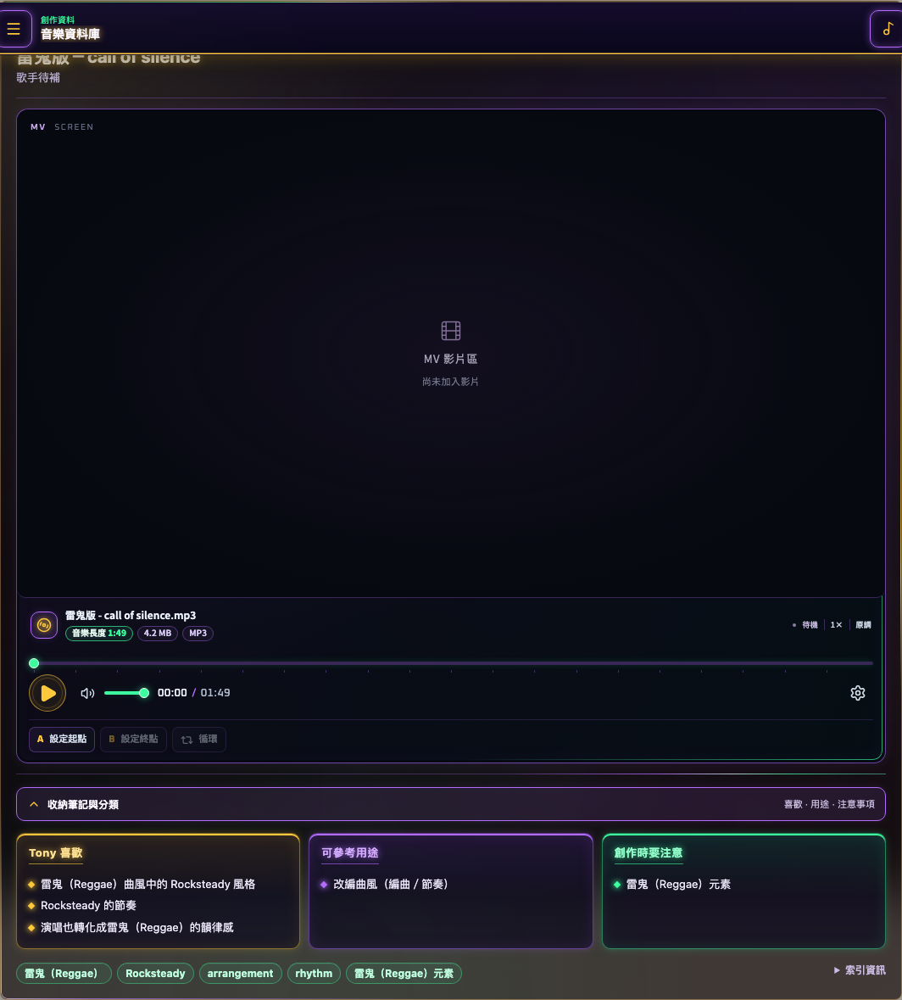

# 參考音樂與隨附曲目

0.32.17 起隨附下列兩首 MP3，開啟「音樂資料庫 → 參考資料庫」即會出現，不用另外匯入，也不需要外接硬碟或 FFmpeg：

| 歌曲 | 曲風 | 參考用途 |
| --- | --- | --- |
| pop city — call of silence | City Pop | 貝斯運用編程、編曲與節奏 |
| 雷鬼版 — call of silence | Reggae / Rocksteady | 曲風改編、編曲與節奏 |

每首都附 Tony 喜歡、可參考用途、創作時要注意三欄筆記及播放器。0.32.19 起，三欄筆記、標籤及索引資訊預設收起，按「展開筆記與分類」即可查看；收納不會中斷音樂。按卡片旁的 MV 鍵可展開各自的內建影片，支援全螢幕和隨音樂播放的背景影片；下方集中顯示檔名、音檔資訊與播放控制。音檔直接隨 App 提供；本機資料庫只建立索引，重開不會重複新增。更新舊版 App 後首次進入資料庫也會加入；已存在同一歌曲的本機索引與個人收藏不會被覆寫。重新掃描只處理個人來源檔案，內建曲目保留。



## 加入自己的參考音樂

桌面 App 預設使用「文件 / Songzu Music OS Data / music-db」。資料庫頁面會顯示目前來源路徑。

1. 把有權使用的音檔複製到 `00_INBOX`。MP3、WAV、M4A 等格式可以建立索引；實際播放能力依格式而定。
2. 在 `_metadata/song_notes` 放同名的 Markdown 筆記。
3. 開啟「音樂資料庫 → 參考資料庫」，按「重新掃描並更新索引」。
4. 確認卡片顯示「音檔與筆記已配對」，再試播放。

音檔名稱需包含筆記標題的歌名。例如 `我的練習曲.mp3` 搭配 `我的練習曲.md`：

```markdown
# 我的練習曲 - 自己的名字

- 曲風：Reggae / Rocksteady
- 語言：華語

## 我喜歡
- 輕鬆而穩定的反拍節奏

## 可參考用途
- 編曲風格與貝斯節奏設計

## 創作時在意
- 人聲與節奏留白，避免過多樂器重疊
```

「創作時在意」段落會顯示在卡片的「創作時要注意」。只有音檔或只有筆記時仍可索引，但不會顯示完整配對。掃描只建立索引，不刪除、改名或搬動原始音樂。
